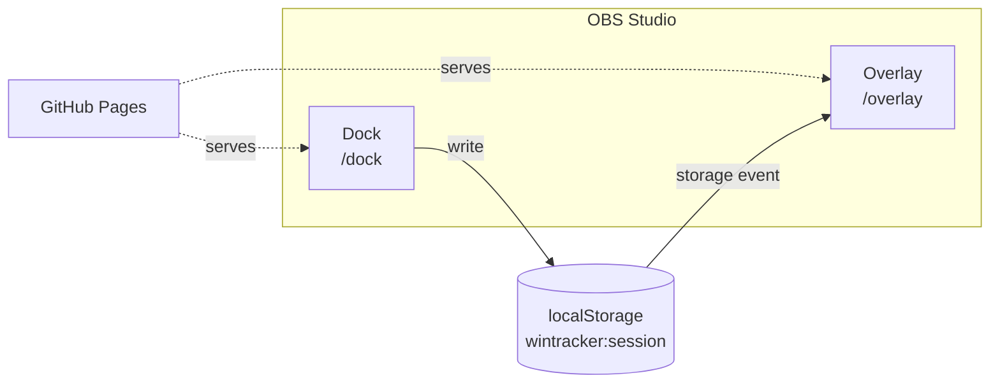
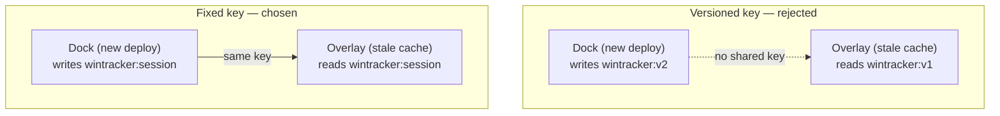
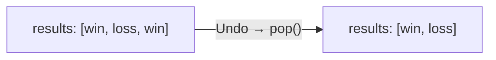
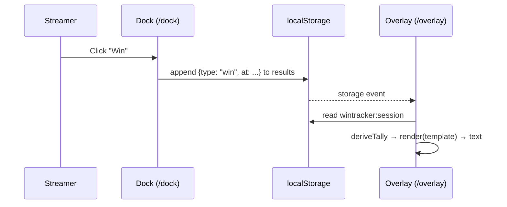

# Streaking — Engineering Design Document (EDD)

**Date:** 2026-08-21

## Scope

Phase 1 only: repo scaffolding, Dock/Overlay routing, localStorage schema, sync, the template
renderer, mobile-first Dock layout. Profiles (Phase 2) and icon packs (Phase 3) get their own
EDD addenda later.

## Tech stack

- **SvelteKit + `adapter-static`**, prerendering `/dock` and `/overlay` to static `index.html`
  files — GitHub Pages serves them with no server-side rewrites.
- Deployed to **GitHub Pages**.
- No backend, no external services.

## Architecture overview



## Repo structure (proposed)

```
wintracker/
├── docs/                          product + engineering docs (this file, PRODUCT, USER_MANUAL)
├── src/
│   ├── routes/
│   │   ├── dock/+page.svelte      Dock UI
│   │   ├── overlay/+page.svelte   Overlay UI
│   │   └── +layout.ts             prerender = true
│   ├── lib/
│   │   ├── tally.ts               tally state store + localStorage persistence
│   │   ├── sync.ts                cross-view sync (storage event listener)
│   │   └── template.ts            token renderer for output templates
│   └── app.html
├── static/
├── svelte.config.js               adapter-static config
└── package.json
```

## Data schema (localStorage)

Single JSON blob under one fixed key, `wintracker:session`:

```json
{
  "version": 1,
  "startedAt": "2026-08-21T17:00:00.000Z",
  "results": [
    { "type": "win", "at": "2026-08-21T17:02:13.000Z" },
    { "type": "loss", "at": "2026-08-21T17:05:44.000Z" }
  ],
  "template": "{wins}W {losses}L {ties}T"
}
```

- `version` — reserved for Phase 2 schema migration.
- `startedAt` — set on the first result, or when **New Session** is clicked.
- `results` — append-only event log, not counters. Wins/losses/ties/total are always derived
  (`deriveTally(results)`), never stored, so they can't drift and never lose per-event data.
- Single flat key → one write, one `storage` event, one re-render.

### Why a fixed key, not `wintracker:v1` / `wintracker:v2`



Dock and Overlay cache independently in OBS — an Overlay can go weeks without a refresh. A
versioned key risks the two silently writing/reading different keys. `version` lives inside the
blob instead; a `migrate()` function in `tally.ts` upgrades old shapes on read.

**Rule:** all future schema growth (Phase 2 profiles, etc.) stays inside this one key.

### Undo



Undo removes the last `results` entry — no separate tracking field, multi-level for free.
Per-bucket decrement buttons were rejected: they'd double the Dock's button count, fighting the
mobile-first large-touch-target goal. **New Session** clears `results`.

## Dock ↔ Overlay sync mechanism



Both views share one origin and one key; the native `storage` event is the sync primitive — no
polling, no server.

**Open risk**: unconfirmed whether OBS's CEF fires `storage` events between a docked panel and
a scene's Browser Source. Fallback if not: poll the Overlay every ~500ms.

## Output template renderer

- `deriveTally(results): Tally` — counts entries by `type`.
- `render(template, tally): string` — regex replace `/\{(\w+)\}/g`; unmatched tokens pass
  through unchanged.
- No templating library.
- Future tokens (e.g. `{winrate}`) need no schema change — `deriveTally` computes them from
  `results`, same as `wins`/`losses`/`ties`.

## Mobile-first Dock layout

- Dock: mobile-first CSS (~320px base, `min-width` media queries scale up), large touch
  targets.
- Overlay: fluid/relative sizing instead — it's resized to an arbitrary pixel box in a scene,
  not a device viewport.

## Deployment

- **GitHub Actions** on push to `main`: build (`adapter-static`) → `upload-pages-artifact` →
  `deploy-pages`. Pages source = "GitHub Actions," not a `gh-pages` branch.
- Keeps built artifacts out of source control and catches build failures in CI.

## Open questions for next pass

None remaining for Phase 1 — ready to scaffold the SvelteKit repo.
