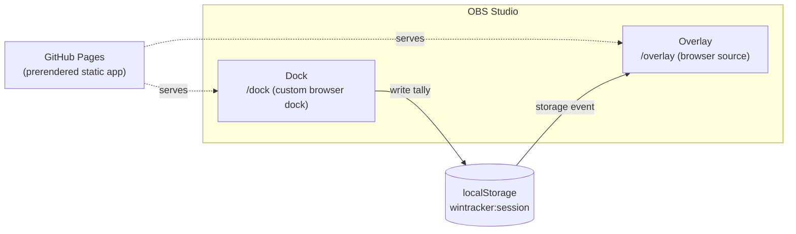
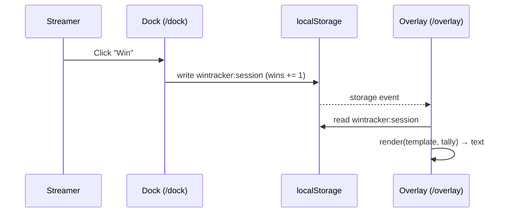

# Streaking — Engineering Design Document (EDD)

**Date:** 2026-08-21

## Scope

Phase 1 only (the generic tracker): repo scaffolding, Dock/Overlay routing, the localStorage
data schema, the dock↔overlay sync mechanism, the output-template renderer, and the mobile-first
Dock layout. Profiles (Phase 2) and icon packs (Phase 3) are out of scope here and will get
their own EDD addenda when those phases start.

## Tech stack

- **SvelteKit + `adapter-static`**, prerendering `/dock` and `/overlay` as static routes — each
  ships as its own `index.html`, so GitHub Pages can serve them directly with no server-side
  rewrites.
- Deployed to **GitHub Pages** from this repo.
- No backend, no external services in Phase 1.

## Architecture overview



## Repo structure (proposed)

```
wintracker/
├── docs/                          product + engineering docs (this file, PRODUCT, USER_MANUAL)
├── src/
│   ├── routes/
│   │   ├── dock/+page.svelte      Dock UI
│   │   ├── overlay/+page.svelte   Overlay UI
│   │   └── +layout.ts             prerender = true
│   ├── lib/
│   │   ├── tally.ts               tally state store + localStorage persistence
│   │   ├── sync.ts                cross-view sync (storage event listener)
│   │   └── template.ts            token renderer for output templates
│   └── app.html
├── static/
├── svelte.config.js               adapter-static config
└── package.json
```

## Data schema (localStorage)

A single JSON blob under one key, e.g. `wintracker:session`:

```json
{
  "version": 1,
  "startedAt": "2026-08-21T17:00:00.000Z",
  "wins": 0,
  "losses": 0,
  "ties": 0,
  "template": "{wins}W {losses}L {ties}T"
}
```

- `version` is present from day one so Phase 2 (profiles) can migrate the schema without
  breaking existing users' saved data.
- `startedAt` records when the current session began (set on first tally write, or when
  **New Session** is clicked — this is the explicit control that closes out the previous
  session and starts a new one).
  It's stored now, while it's cheap, purely so a future session-history feature doesn't need a
  migration to backfill it. No history UI or storage of *past* sessions ships in Phase 1 —
  that's deferred until after Phase 2 (profiles), since a useful history view needs to account
  for per-profile tallies too.
- One flat key (not one key per field) keeps the `storage` event trivial to react to — a single
  write triggers a single event and a single re-render.

### Key naming & versioning

- The localStorage key name is **fixed**: `wintracker:session`. It never changes across schema
  versions — only the `version` field inside the blob does.
- Rationale: the Dock and Overlay are independently-cached OBS browser sources (an Overlay can
  sit unrefreshed for weeks after the Dock picks up a new deploy). If the key name itself
  encoded the version (e.g. `wintracker:v1` → `wintracker:v2`), a stale Overlay and a fresh
  Dock could silently end up reading/writing *different keys* — a total, silent sync failure.
  A fixed key sidesteps that entirely: the `storage` event always fires on the same key
  regardless of code-version skew between the two views.
- On load, a `migrate(raw: unknown): Session` function in `src/lib/tally.ts` inspects the
  `version` field and upgrades older shapes to the current one in memory, then writes the
  upgraded shape straight back. Fields a stale cached bundle doesn't recognize are simply
  ignored rather than causing errors.
- **Rule for future phases**: schema growth (Phase 2 profiles, etc.) stays inside this one key.
  Never split session state across multiple localStorage keys — that would require the sync
  listener to watch multiple keys and reassemble state, breaking the single-write/single-event
  simplicity this design relies on.

## Dock ↔ Overlay sync mechanism



- Both `/dock` and `/overlay` read/write the same localStorage key on the same origin.
- The Dock writes on every button click (Win / Loss / Tie / Undo / New Session).
- The Overlay listens for the browser's native `storage` event, which fires in *other*
  tabs/views when localStorage changes — the built-in cross-tab sync primitive, no polling
  needed in the common case.
- **Open risk (carried over from `2026-08-21-PRODUCT.md`)**: needs a smoke test to confirm
  OBS's embedded Chromium (CEF) actually fires `storage` events between a custom browser Dock
  and a scene's Browser Source for the same origin. If it doesn't, the fallback is a short
  polling interval (e.g. re-read localStorage every 500ms) in the Overlay only.

## Output template renderer

- Pure function: `render(template: string, tally: Tally): string`.
- Implementation: a single regex replace, `/\{(\w+)\}/g`, looking up each captured name against
  a `{wins, losses, ties, total}` map; an unmatched name passes through unchanged (the literal
  `{token}` is returned as-is).
- No templating library needed — intentionally minimal.

## Mobile-first Dock layout

- Dock CSS is written mobile-first: base styles target a narrow (~320px) viewport, with
  `min-width` media queries progressively enhancing for wider panels.
- Win / Loss / Tie / Undo / Reset are large touch targets by default, not shrunk-to-fit
  desktop-first assumptions.
- The Overlay is **not** mobile-first — it uses fluid/relative sizing (e.g. viewport-relative or
  container-relative font sizing) since it's resized to an arbitrary pixel size as an OBS
  Browser Source, not a device viewport.

## Deployment

- **GitHub Actions**, triggered on every push to `main` — not a manual `gh-pages` branch push.
- Workflow (`.github/workflows/deploy.yml`): checkout → install deps → `npm run build`
  (SvelteKit + `adapter-static` outputs static files, including the prerendered `/dock` and
  `/overlay` routes, to `build/`) → `actions/upload-pages-artifact` → `actions/deploy-pages`.
- Repo's **Settings → Pages → Source** is set to "GitHub Actions," not a `gh-pages` branch.
- Rationale: no manually-built artifacts committed to source control, CI catches build failures
  on every push instead of relying on a remembered local rebuild, and this is the current
  standard path for static-site frameworks on GitHub Pages.

## Open questions for next pass

- Whether Undo needs its own history stack, or simply decrements the last-clicked bucket.
