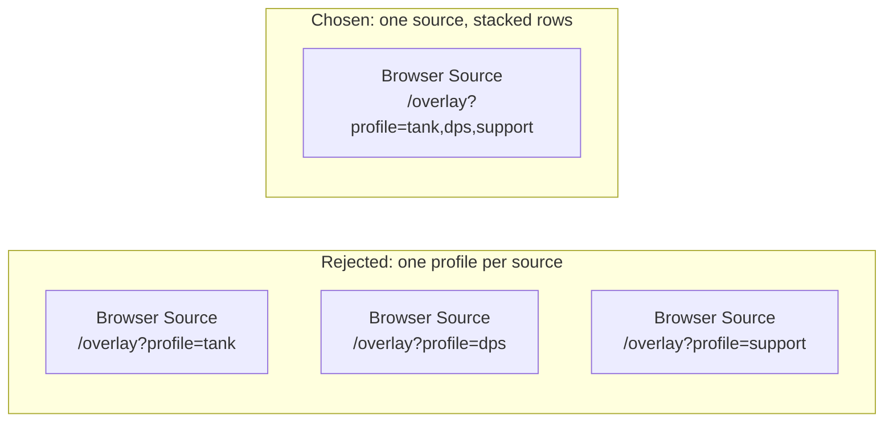
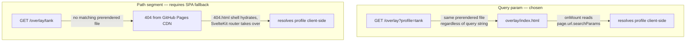
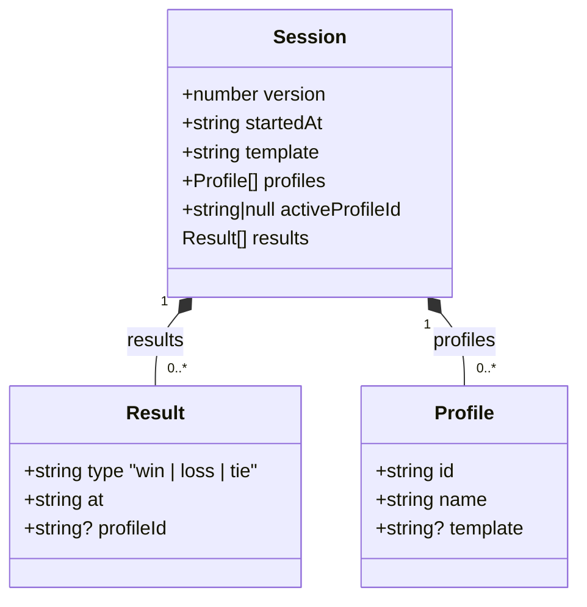
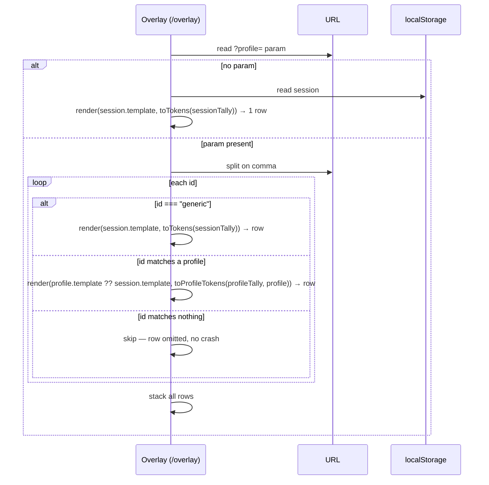

# Streaking — Engineering Design Document, Phase 2 Addendum (Profiles)

**Date:** 2026-08-23

## Scope

Phase 2 only: named profiles, active-profile switching, per-profile tallies, per-profile
Overlay tokens, and multi-profile-in-one-Overlay rendering. Builds on the Phase 1 EDD
(`2026-08-21-EDD.md`), which explicitly deferred this to its own addendum. Icon-per-profile
(Phase 3) is out of scope here.

## Why not one profile per Overlay instance

The initial framing was: one Overlay instance always shows one profile (or the generic
total), and a streamer wanting Tank+DPS+Support on screen simultaneously adds multiple OBS
Browser Sources, one per role — mirroring how OBS scenes normally layer independent pieces of
on-screen info.

This was reconsidered: each Browser Source is its own CEF renderer process, with real CPU/RAM
overhead on top of the game + encoder a streamer is already running. Requiring N Browser
Sources for N roles doesn't scale well, so a single Overlay instance needed to be able to
render several profiles at once.



The key constraint carried over from Phase 1: `render()` stays a flat regex substitution — no
templating engine, no loops, no repeating sections (`docs/2026-08-21-EDD.md` is explicit that
there's "no templating library"). Multi-profile rendering is achieved by calling `render()`
once *per row*, each with its own template and its own plain token set, then stacking the
resulting strings — not by extending `render()`'s syntax.

An earlier iteration of this design instead merged all profiles' tokens into one shared map
with per-profile name-prefixed keys (e.g. `{tank_wins}`, `{dps_wins}`) so a single `render()`
call could produce a hand-composed multi-line string. This was dropped in favor of
independent per-row rendering: it required a `slugify()` helper, invited name-collision edge
cases, and — most importantly — forced streamers to learn a new prefixed-token vocabulary
instead of reusing the exact `{wins}`/`{losses}`/`{ties}`/`{total}` tokens already familiar
from Phase 1.

## Why a query param, not a path segment, for profile selection

Considered: `/overlay?profile=<id>` vs. a path-style URL like `/overlay/tank`.

`adapter-static` is configured with no `fallback` page (`vite.config.ts` calls `adapter()`
with no options), meaning every route must be fully prerenderable at build time. Profile
names are arbitrary, streamer-created values, unknown at build time, on one shared static
build served to every user via GitHub Pages — there is no `entries()` list of profile names
that could ever be correct, regardless of where in the path the dynamic segment sits
(`/overlay/[profile]`, `/overlay/profile/[profile]`, etc. all have the same problem).

A path-style URL is achievable, but only by switching `adapter-static` to SPA-fallback mode
(`adapter({ fallback: '404.html' })`) combined with the well-known GitHub Pages trick of
serving `404.html` as a catch-all shell for any unmatched path (the browser gets an HTTP 404
from the CDN but still renders and hydrates; SvelteKit's client router then resolves the
path normally). That's real, if well-trodden, plumbing on top of what exists today, and it
applies site-wide — `/dock`, `/overlay`, and `/` stay prerendered and unaffected, but *any*
other unmatched path now falls through to that shell.

Query params need zero config changes: GitHub Pages serves the same prerendered
`overlay/index.html` regardless of query string, and the param is read client-side in
`onMount`, exactly like the existing `localStorage` reads already are (guarding against
prerender-time execution, which has no query string or `localStorage` to read).



**Migration path, if ever wanted:** adding path-style URLs later is strictly additive and
backward-compatible — a new `[profile]` route checked first, falling back to the query param
— so any `?profile=` URLs a streamer has already pasted into OBS keep working indefinitely.
Not needed for this phase.

The query param accepts a **comma-separated list of profile ids**, plus the reserved literal
`generic` to include the session-wide aggregate as one of the stacked rows:
`?profile=<id1>,<id2>,generic`. A single id is just the N=1 case — no special-casing needed
in the Overlay's row-building logic.

## Why the Overlay never reads the Dock's active profile

> **Addendum (2026-08-24): this decision was reversed.** See below.

Bare `/overlay` (no `?profile=` param at all) renders exactly as Phase 1 did — one row,
`session.template` against the session-wide tally — regardless of whatever profile is
currently active in the Dock. An Overlay's content is fully determined by its own URL.

This was a deliberate choice, not an oversight: the Dock's active-profile selector exists
only to control which profile new Win/Loss/Tie clicks are attributed to. If the Overlay
instead fell back to "whatever's active right now," an already-configured OBS Browser Source
would silently change its displayed content whenever the streamer switched roles in the Dock
for attribution purposes — a surprising coupling between two conceptually separate actions,
and one that would make a given Browser Source's behavior depend on Dock state at the moment
of rendering rather than on its own URL.

### Addendum (2026-08-24): reversed based on user testing

User testing showed the opposite intuition in practice: streamers expect that switching the
active profile in the Dock updates whatever's already on screen in OBS, and a static Overlay
that *doesn't* react to that is the surprising behavior, not the reverse. Most streamers also
never revisit an Overlay's URL once it's pasted into an OBS Browser Source, so an opt-in-only
mechanism (e.g. a special reserved query value) wouldn't reach them.

As of this addendum, bare `/overlay` (no `profile` param) now tracks `session.activeProfileId`
live — rendering that profile's row, or the generic aggregate row if `null` — via the same
`storage`-event sync already used for live tally updates
(`src/lib/sync.ts`; no new transport). This is now the *default*, unconfigured behavior.

The original reasoning still holds for **explicit** URLs, which are unchanged:
`?profile=generic` stays permanently pinned to the generic aggregate, and
`?profile=<id1>,<id2>,...` stays permanently pinned to that fixed set of profiles/generic —
both regardless of Dock switching. These remain the mechanism for deliberate fixed
compositions (e.g. Tank+DPS+Support stacked in one scene), which is exactly the case the
original design was protecting. Only the *unconfigured* default flipped.

## Data schema

Builds on the Phase 1 `Session` shape (`docs/2026-08-21-EDD.md`), staying inside the same
`wintracker:session` key per that EDD's explicit rule ("all future schema growth... stays
inside this one key"):

```ts
export interface Profile {
    id: string;
    name: string;
    template?: string; // undefined = use Session.template
}

export interface Result {
    type: ResultType;
    at: string;
    profileId?: string; // undefined = generic/no-profile bucket
}

export interface Session {
    version: number; // 1 → 2
    startedAt: string;
    results: Result[];
    template: string; // unchanged: generic row template, AND the fallback for any profile without its own override
    profiles: Profile[];
    activeProfileId: string | null; // null = generic
}
```



### Why only two template fields, not three

An earlier iteration introduced a third field, `Session.profileTemplate`, as a shared
"default profile row" fallback distinct from the generic `Session.template` — reasoning that
the generic row (singular, no name needed) and a profile row (potentially one of several
stacked rows, benefiting from a name to disambiguate) wanted different default content.

This was simplified away: `Profile.template` (optional) falls back directly to the
*existing* `Session.template` — the same field that already renders the generic row. A
profile without its own override simply looks like the generic row by default (plain
numbers, no name) until customized. This means only two template-bearing fields exist in the
whole schema (`Session.template`, `Profile.template`), and it's consistent with how the
template field already behaves in Phase 1: nothing is auto-labeled, the user configures what
they want. `Session.template`'s default content (`{wins}W {losses}L {ties}T`) is deliberately
left unchanged rather than given a name token, so the plain Phase 1 experience is unaffected
for streamers who never touch profiles.

### Migration

```ts
function migrate(raw: any): Session {
    if (raw.version === 1) {
        return { ...raw, version: 2, profiles: [], activeProfileId: null };
    }
    return raw as Session;
}
```

The previous `migrate(raw: Session): Session` signature cast the parsed JSON as `Session`
*before* the version check ran, which would have silently lied to the type checker the moment
a real branch was added — v1 data on disk would type-check as if it already had `profiles`/
`activeProfileId`. Fixed by accepting loosely-typed input and branching explicitly on
`version`, with `loadSession()` passing the raw parsed JSON straight through rather than
pre-casting it.

`newSession()` preserves `profiles`/`activeProfileId` from the *previous* session — they're
durable configuration, like `template`, not session-scoped data that "New Session" should
reset. (Note: `newSession()` currently also resets `template` to its default via
`emptySession()` — a pre-existing Phase 1 quirk, unrelated to this addendum, not addressed
here.)

Deleting a profile clears `activeProfileId` if it pointed at the deleted profile, but leaves
historical `results[].profileId` tags orphaned rather than rewriting history — consistent
with the append-only philosophy already behind `undo()`/`addResult()` in Phase 1.

## Token layer

```ts
// toProfileTokens(tally, profile) → { ...toTokens(tally), profile_name: profile.name }
```

No prefixing, no per-render namespace: since each profile row is rendered independently (its
own `render()` call, its own template, its own token map), there's no cross-profile token
collision to avoid. `TOKEN_REFERENCE` gains one new static entry, `{profile_name}` — no
dynamic/generated entries needed, since every token name is now a fixed, known string.

## Overlay rendering



An id that doesn't resolve to a known profile (deleted, typo, stale copied URL) is simply
omitted as a whole row, rather than leaving unresolved literal tokens visible mid-string —
a cleaner failure mode than Phase 1's per-token passthrough, made possible by rows being
independently rendered instead of merged into one template.

`sync.ts`'s `storage`-event listener needs no changes — it's still keyed on the single
`wintracker:session` key, and this is purely additional row-building logic inside the
Overlay's existing `refresh()`.

## Dock UI additions

- **Profile switcher**: a chip row (same visual language as the Win/Loss/Tie buttons),
  controlling `activeProfileId` for tallying attribution only — never what an Overlay
  displays (see above). Uses plain CSS `flex-wrap`, not horizontal scroll or a
  count-based `<select>` fallback, so it degrades gracefully as profile count grows — same
  reflow idiom as the existing button grid, just unbounded instead of fixed at 3. Expected
  scale is small (single-digit profiles for role-based games), so this is a CSS concern, not
  a data-structure one.
- **Profile CRUD**: add/rename/delete, reusing the existing blur/Enter-commit pattern already
  established for the session template field.
- **Per-profile template override**: a "Custom format" checkbox + a single text input per
  profile, rather than two input elements swapped via conditional rendering. Unchecked: the
  input is disabled and shows the live `session.template` value (a preview of what the
  profile will render with). Checked: the input is enabled, seeded with a copy of
  `session.template`'s current text, and edits that profile's own override via the usual
  blur/Enter commit. Unchecking commits immediately (clearing the override), since it's a
  discrete state change rather than text entry. One input element, not two, avoids duplicate
  markup and focus-loss from swapping DOM nodes.
- **Copy overlay URL**: single-profile buttons (and one for Generic, copying the bare
  `/overlay` URL) for the common case, plus a second set of checkboxes (distinct from the
  "Custom format" checkboxes) feeding a "Copy URL for selected" action that joins checked ids
  into one comma-separated multi-profile link. All copy actions fall back to a manual-copy
  `<input>` (readonly, pre-selected) if `navigator.clipboard.writeText` fails, since the
  Clipboard API needs a secure context and sometimes document focus — both potentially flaky
  inside OBS's embedded CEF browser dock.
