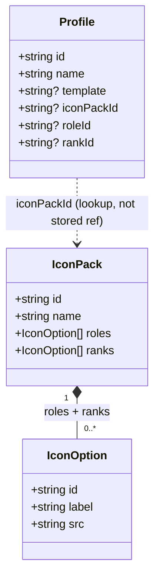
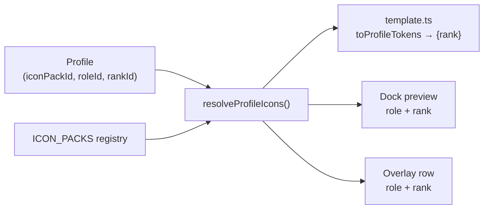
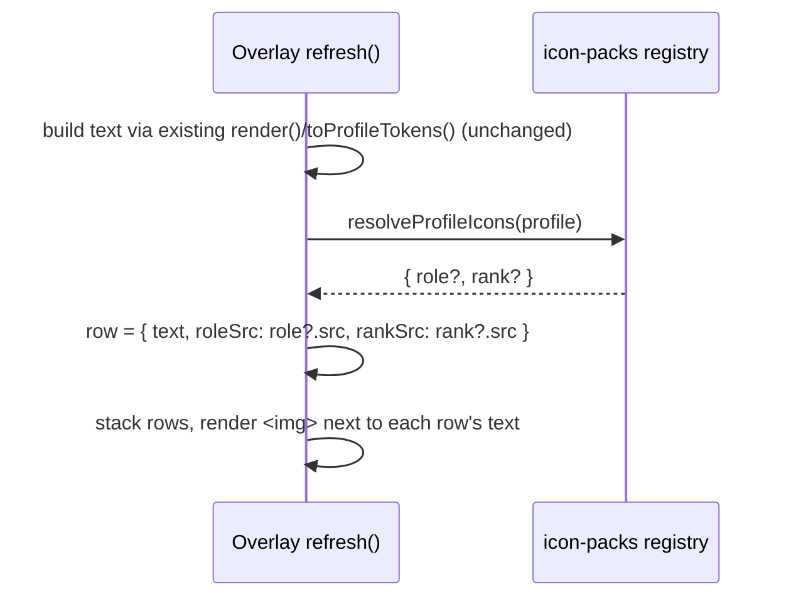

# Streaking — Engineering Design Document, Phase 3 Addendum (Icon Packs)

**Date:** 2026-08-24

## Scope

1. Overwatch icon pack only. CS2 and others are future packs, not built here.
2. Two icon kinds per pack: **role icons** (Tank/Damage/Support) and **rank
   badges** (Bronze → Champion, 8 tiers, no per-division variants).
3. Selection is manual, per profile, in Profile Settings — no live game API.
4. Rendered on the Dock (streamer preview) and the Overlay (viewer-facing).
5. Out of scope: per-division rank badges, role icons as a text token (see
   Token layer), non-Overwatch packs.

## Data schema

Extends `Profile` (Phase 2, `docs/2026-08-23-EDD-PHASE2.md`), staying inside
the single `wintracker:session` key per the Phase 1 rule.

```ts
export interface Profile {
	id: string;
	name: string;
	template?: string;
	iconPackId?: string; // e.g. "overwatch"
	roleId?: string;     // e.g. "tank" | "damage" | "support"
	rankId?: string;     // e.g. "gold"
}
```



All three new fields are optional — no structural change to existing v2
profiles, so migration is a version-stamp passthrough:

```ts
function migrate(raw: any): Session {
	if (raw.version === 1) {
		return { ...raw, version: 2, profiles: [], activeProfileId: null };
	}
	if (raw.version === 2) {
		return { ...raw, version: 3 };
	}
	return raw as Session;
}
```

## Why ids, not a stored image reference

`Profile` stores `iconPackId`/`roleId`/`rankId` — small stable strings — not an
image path or data URL. Resolution to an actual asset happens at render time
via the registry (below). This means:

1. Renaming/moving an asset file only touches the registry module, never
   stored session data.
2. `localStorage` payload stays tiny (ids, not image bytes/paths).
3. A future pack swap (e.g. re-sourcing better art) is a registry-only change.

## Icon pack registry

New module, `src/lib/icon-packs/`, not touching `tally.ts`:

1. `overwatch.ts` — imports the bundled asset files, exports
   `OVERWATCH_PACK: IconPack` (`roles: IconOption[]`, `ranks: IconOption[]`).
2. `index.ts` — exports `ICON_PACKS: IconPack[]`, `getPack(id)`, and
   `resolveProfileIcons(profile): { role?: IconOption; rank?: IconOption }`.

`resolveProfileIcons` is the single lookup point every consumer shares:



Adding a future pack (e.g. CS2) is appending one more module to `ICON_PACKS`
— no schema change, no change to `resolveProfileIcons`'s callers.

## Token layer

`toProfileTokens` gains one token:

```ts
rank: resolveProfileIcons(profile).rank?.label ?? ''
```

No `{role}` token. Rationale: profiles are already conventionally named after
their role ("Tank", "DPS" — see the existing hint text in
`ProfileSettings.svelte`), so `{profile_name}` already serves that purpose.
Rank has no equivalent existing text source — it changes over time and isn't
naturally embedded in a profile's name — so it's the only new token needed.
Role still gets an *image* (the badge), just not a second text token.

## Rendering

**Dock** — active profile's role + rank badge shown as small ``s (chip
row or `.profile-tally` block), via `resolveProfileIcons()`. Pure
confirmation UI; no schema/token involvement.

**Overlay** — `rows` changes from `string[]` to a structured type:

```ts
type OverlayRow = { text: string; roleSrc?: string; rankSrc?: string };
```



Text rendering is untouched by this addendum (already correct once the token
layer above lands) — this section only adds the parallel image element.

## Assets & trademark

1. Role icons sourced from the official Overwatch heroes page; rank badges
   from official/wiki-hosted Overwatch competitive badge art.
2. Bundled as Vite asset imports under
   `src/lib/assets/icon-packs/overwatch/{roles,ranks}/`, following the
   existing `$lib/assets` convention (hashed, cache-friendly).
3. Per the trademark-risk note in `docs/2026-08-21-PRODUCT.md`: officially-
   sourced art is bundled directly, not custom-drawn or user-supplied. A
   fan-made / non-affiliation disclaimer is added (README or `NOTICE.md`).

## Open items / future

1. CS2 pack: next candidate, same registry shape.
2. Per-division rank granularity: explicitly deferred, not designed here.
3. Role/rank precedence vs. a possible future user-uploaded custom icon
   (mentioned as a Phase 2 aspiration in the Product doc but never built):
   undefined, revisit if that ships later.
