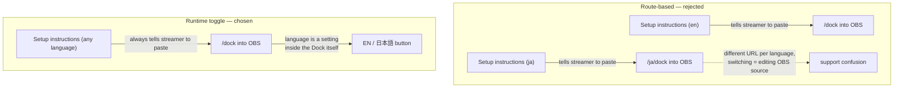
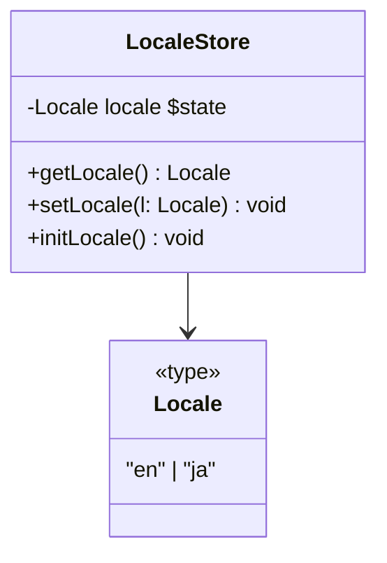
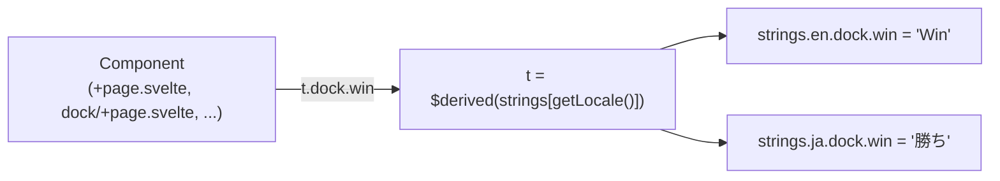
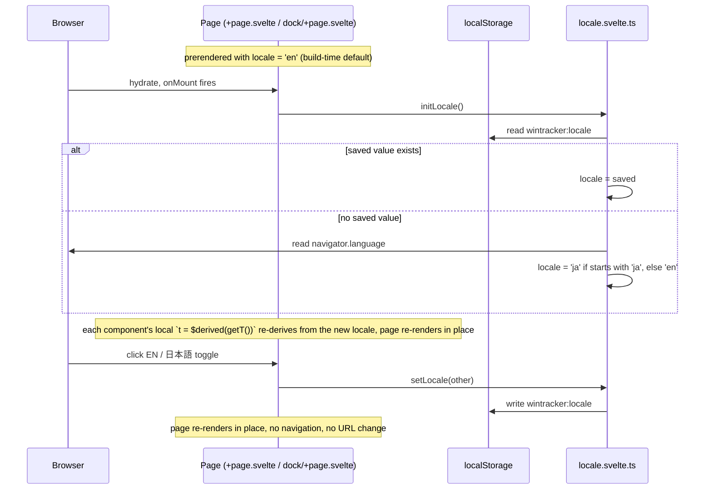

# Streaking — Engineering Design Document Addendum (Localization)

**Date:** 2026-08-25

## Scope

Add a Japanese translation of the in-app UI and setup instructions. Covers
`src/routes/+page.svelte` (landing/instructions), `src/routes/dock/+page.svelte`, and the
components they render user-facing strings through: `ProfileSettings.svelte`,
`HelpOverlay.svelte`, `CopyUrlButton.svelte`. Out of scope: `docs/*.md` and `README.md`
(GitHub/developer-facing, never shown in-app), and `IconPackPicker.svelte`'s role/rank labels
("Tank", "Gold", etc.), which are Overwatch brand/rank terms, not app copy. `/overlay` needs no
changes — its rendered output is entirely the streamer's own template text; it has zero
hardcoded strings today.

## Why not route-based locale

The obvious-looking alternative is prerendering a Japanese variant of each page at its own URL —
`/dock` vs `/ja/dock` — using SvelteKit's optional route parameters
(`[[locale=lang]]`) with `adapter-static`'s `entries` list. This was seriously considered and
rejected.



Route-based locale gives a correctly-baked `<html lang>` and no client-side hydration flash —
genuinely useful for a public, shareable, search-indexed page. But `/dock` and `/overlay` are
private control-panel URLs pasted once into an OBS Browser Source, never discovered via search.
Splitting them by language means the Setup instructions have to say "use *this* URL if you read
Japanese, *that* URL if you read English," and switching a Dock's displayed language later means
re-editing the OBS source's Properties dialog rather than clicking a button inside the page
that's already open.

The original motivation for routes was a belief that `localStorage`-backed state isn't reliable
inside OBS's embedded CEF browser, so a URL-encoded preference would be more durable than a
toggled one. That argument doesn't actually hold: the Dock's entire win/loss/tie tally already
lives in `localStorage` at this same origin, read by this same embedded browser
(`src/lib/tally.ts`) — if that weren't reliable, the app would already be broken for its core
feature, not just for a language preference. (`localStorage` is also origin-scoped, not
path-scoped, so even a route split would have shared session data between `/dock` and `/ja/dock`
— this wasn't the actual risk.)

Chosen instead: `/`, `/dock`, and `/overlay` keep their exact current URLs for every user,
regardless of language. Language is a client-side preference, persisted like everything else the
app already persists.

## Locale store



`src/lib/i18n/locale.svelte.ts` mirrors the existing `$state` + `localStorage` idiom already used
by `src/lib/tally.ts` and `src/lib/sync.ts` — no new persistence mechanism introduced.

```ts
const STORAGE_KEY = 'wintracker:locale';
export type Locale = 'en' | 'ja';

let locale = $state<Locale>('en'); // prerender-safe default; no navigator in Node

export function getLocale(): Locale {
    return locale;
}

export function setLocale(l: Locale) {
    locale = l;
    localStorage.setItem(STORAGE_KEY, l);
}

// call from onMount — browser-only, same guard pattern as tally.ts's loadSession()
export function initLocale() {
    const saved = localStorage.getItem(STORAGE_KEY);
    if (saved === 'en' || saved === 'ja') {
        locale = saved;
        return;
    }
    locale = navigator.language.startsWith('ja') ? 'ja' : 'en';
}
```

`initLocale()` is called once from each entry route's existing `onMount` (`+page.svelte` already
has one for `origin`; `dock/+page.svelte` already has one for `refresh()`) — no new lifecycle
hook, just one more line in each.

## String dictionary

Flat, namespaced-by-component keys, no ICU/plural syntax — every string used today is static
text with at most a couple of dynamic values, which stay outside the translated string (see
below).

Statically-checked accessor instead of a string-keyed lookup: `strings` is declared `as const`,
so a `$derived` re-export of the locale-selected branch gives every call site compile-time
key checking and autocomplete, with no separate type-level path machinery. A typo like
`t.dock.wnn` is a build error, not a silent runtime fallback.



```ts
// strings.ts
export const strings = {
    en: {
        dock: { win: 'Win', loss: 'Loss', tie: 'Tie', undo: 'Undo', newSession: 'New Session' },
        // landing.*, profileSettings.*, helpOverlay.*, copyUrlButton.* similarly namespaced
    },
    ja: {
        dock: { win: '勝ち', loss: '負け', tie: '引き分け', undo: '元に戻す', newSession: '新しいセッション' },
    },
} as const;
```

```ts
// locale.svelte.ts
export function getT() {
    return strings[getLocale()];
}
```

Svelte forbids exporting a `$derived` value directly from a module — `derived_invalid_export`,
surfaced only at SSR/build time, not by `svelte-check`/`tsc`. Fix per Svelte's own guidance:
export a plain function instead, and let each consuming component derive its own local `t` from
it — the module owns the state, the component owns the reactive subscription.

```svelte
<!-- call site -->
<script lang="ts">
    import { getT } from '$lib/i18n/locale.svelte';
    let t = $derived(getT());
</script>
{t.dock.win}
```

### Static markup vs. dynamic content

Most instructional prose in `+page.svelte` mixes plain text with `<strong>`/`<code>` spans. Two
different rendering rules apply, decided per-paragraph:

- **Pure static markup** (bold/code spans, no embedded Svelte expression): stored as one HTML
  string in the dictionary, rendered with `{@html t(...)}`. Safe because these are
  developer-authored translation strings, not user input — same trust boundary as any other
  literal in the codebase.
- **Paragraphs interleaving dynamic values** (the `dockUrl`/`overlayUrl` links,
  `<enhanced:img>` elements, which can't be represented as a string at all): the translation key
  covers only the surrounding text fragments; the dynamic markup stays in the template,
  untranslated structurally, exactly where it is today.

## Toggle flow



## File map

```
src/
  lib/
    i18n/
      locale.svelte.ts          NEW — $state<Locale>, getLocale/setLocale/initLocale, getT()
      strings.ts                NEW — en/ja dictionaries (as const)
    components/
      LanguageToggle.svelte     NEW — "EN / 日本語" button, calls setLocale()
      ProfileSettings.svelte    MODIFIED — strings -> t.*
      HelpOverlay.svelte        MODIFIED — strings -> t.*
      CopyUrlButton.svelte      MODIFIED — strings -> t.*
  routes/
    +page.svelte                MODIFIED — strings -> t.*, initLocale() in onMount, renders <LanguageToggle/>
    dock/+page.svelte           MODIFIED — strings -> t.*, initLocale() in onMount, renders <LanguageToggle/>
    overlay/+page.svelte        unchanged
```

## Migration path, if ever wanted

The typed-object accessor (`t.dock.win`) maps directly onto Paraglide's generated per-key
functions (`m.dock_win()`) — both are statically-checked call sites, not string keys. Moving to
Paraglide later is a data reshape (object → JSON) plus a call-site find/replace, not an
architecture change. Moving to svelte-i18n instead would mean giving up static checking for its
string-keyed `$_('dock.win')`, so Paraglide is the more natural next step if this is ever
outgrown. The one thing that would force a real rewrite is introducing pluralization/ICU
interpolation, which nothing here needs today.

## Implementation plan

Ordered so every step leaves the tree in a compiling, green-build state and each step only
depends on files already created in an earlier step. Steps 1–4 add inert, unimported code
(data and a store); steps 5–7 wire one leaf component at a time; steps 8–9 wire the two entry
routes and turn the toggle on; step 10 is manual verification, no code change.

1. **`src/lib/i18n/strings.ts` — English dictionary.** Add the `strings.en` object (`as const`),
   namespaced `dock.*`, `landing.*`, `profileSettings.*`, `helpOverlay.*`, `copyUrlButton.*`,
   sourced from the current hardcoded copy in each component. `strings.ja` not yet added, file
   is unimported — builds clean as dead code.
2. **`src/lib/i18n/strings.ts` — Japanese dictionary.** Add the parallel `strings.ja` object with
   the same key shape. Pure data addition, still unimported.
3. **`src/lib/i18n/locale.svelte.ts` — locale store.** `Locale` type, `$state<Locale>`,
   `getLocale`/`setLocale`/`initLocale` per the Locale store section above, plus
   `export function getT() { return strings[getLocale()]; }` (a plain function, not an exported
   `$derived` — Svelte forbids the latter). Still unimported by any route.
4. **`src/lib/components/LanguageToggle.svelte` — new component.** "EN / 日本語" button calling
   `setLocale()` on click. Not yet rendered anywhere, builds standalone.
5. **`ProfileSettings.svelte` — swap to `t.profileSettings.*`.** Import `getT`, declare
   `let t = $derived(getT());` locally, then replace hardcoded strings with the typed accessor.
   First real usage of `t`; confirms the accessor shape end-to-end for one component before
   touching the rest.
6. **`HelpOverlay.svelte` — swap to `t.helpOverlay.*`.** Same mechanical swap, second component.
7. **`CopyUrlButton.svelte` — swap to `t.copyUrlButton.*`.** Same mechanical swap, third
   component.
8. **`src/routes/+page.svelte` — landing page wiring.** Swap hardcoded copy to `t.landing.*`
   (including the static-markup-vs-dynamic-content split described above), call `initLocale()`
   from the existing `onMount`, render `<LanguageToggle/>`. This is the first point the toggle
   is actually reachable in the UI.
9. **`src/routes/dock/+page.svelte` — Dock wiring.** Same pattern: `t.dock.*`, `initLocale()` in
   the existing `onMount`, render `<LanguageToggle/>`.
10. **Manual verification.** Toggle EN ⇄ 日本語 on both `/` and `/dock`; confirm the choice
    persists across reload (`localStorage['wintracker:locale']`) and is independent per the two
    pages sharing the same origin; confirm `/overlay` is untouched. No code change — closes the
    plan.

## Translation feedback link

Post-implementation addition, after manual verification of steps 1–10 passed. The landing page
now shows a small footnote — `landing.translationFeedback`, linking to
`https://github.com/hk0i/streakingftw/issues` — inviting reports of Japanese translation errors.
Two decisions, both made explicitly rather than assumed:

- **Destination:** GitHub Issues, matching the repo's existing `origin` remote
  (`hk0i/streakingftw`) — no new infra.
- **Visibility:** shown when `getLocale() !== 'en'`, not gated to `'ja'` specifically — Japanese
  is the only non-English locale today, but this reads correctly if a second translation is
  added later without another code change here.

Same `{@html}` treatment as the rest of `landing.*` (the string embeds its own `<a>` tag), which
surfaced the same CSS-scoping issue as the `code` selector in step 8: the page's `a { ... }` rule
only matched literal template `<a>` elements, not ones injected via `{@html}`. Fixed by widening
it to `.page :global(a)`, same pattern as `:global(code)`/`:global(picture)`.

## Token meaning translations

Post-implementation addition: `HelpOverlay`'s token-reference table showed `ref.meaning` straight
from `$lib/template.ts`'s `TOKEN_REFERENCE`, untranslated — a gap from the original plan, which
scoped in `HelpOverlay.svelte` but not the data it renders. Token *names* (`{wins}`, `{rank}`,
etc.) stay in English always, matching the actual template syntax users type; only the meaning
column is translated.

`TokenReference` changed from `{ token, meaning }` to `{ token, key }`, where `key` is a
`TokenKey` union (`'wins' | 'losses' | 'ties' | 'total' | 'profile_name' | 'rank'`) — the meaning
text itself moved into `helpOverlay.tokenMeanings` in `strings.en.ts`/`strings.ja.ts`, keyed by
`TokenKey`. `HelpOverlay.svelte` looks it up as `t.helpOverlay.tokenMeanings[ref.key]`.

`strings.en.ts`'s `tokenMeanings` object is additionally typed `satisfies Record<TokenKey, string>`
(importing `TokenKey` from `../template`) — a second, independent parity check on top of the
existing `Dictionary<typeof en>` check on `strings.ja.ts`, so a `TokenReference` entry can never
end up without a translated meaning in either language.

## Open questions for next pass

None — ready to implement per the atomic step sequence above.
