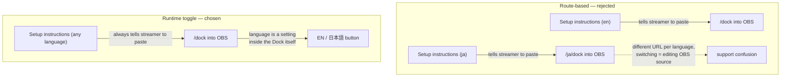
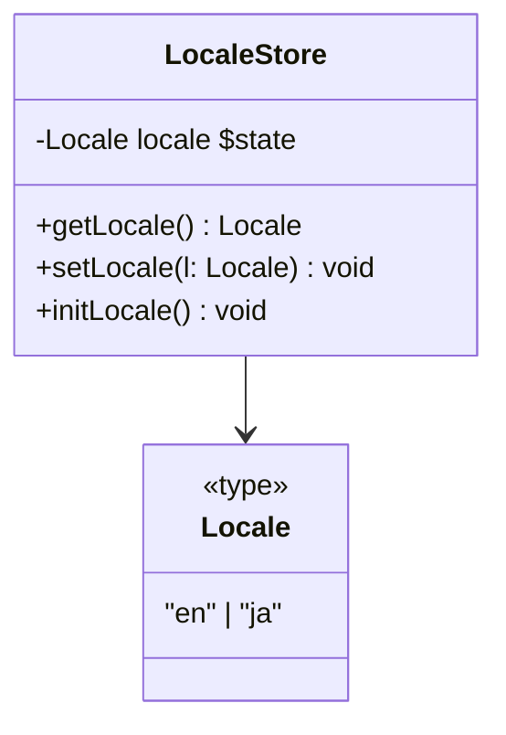
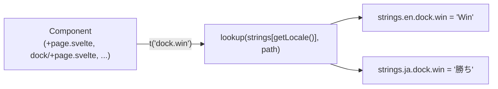
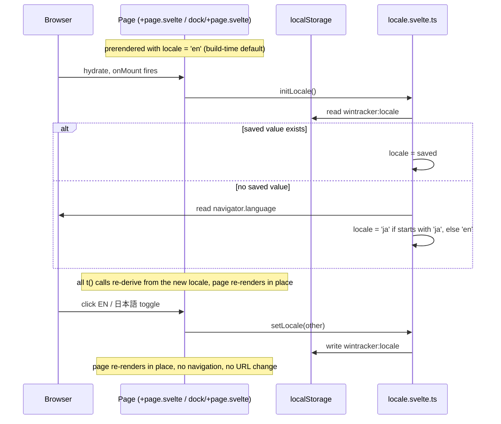

# Streaking — Engineering Design Document Addendum (Localization)

**Date:** 2026-08-25

## Scope

Add a Japanese translation of the in-app UI and setup instructions. Covers
`src/routes/+page.svelte` (landing/instructions), `src/routes/dock/+page.svelte`, and the
components they render user-facing strings through: `ProfileSettings.svelte`,
`HelpOverlay.svelte`, `CopyUrlButton.svelte`. Out of scope: `docs/*.md` and `README.md`
(GitHub/developer-facing, never shown in-app), and `IconPackPicker.svelte`'s role/rank labels
("Tank", "Gold", etc.), which are Overwatch brand/rank terms, not app copy. `/overlay` needs no
changes — its rendered output is entirely the streamer's own template text; it has zero
hardcoded strings today.

## Why not route-based locale

The obvious-looking alternative is prerendering a Japanese variant of each page at its own URL —
`/dock` vs `/ja/dock` — using SvelteKit's optional route parameters
(`[[locale=lang]]`) with `adapter-static`'s `entries` list. This was seriously considered and
rejected.



Route-based locale gives a correctly-baked `<html lang>` and no client-side hydration flash —
genuinely useful for a public, shareable, search-indexed page. But `/dock` and `/overlay` are
private control-panel URLs pasted once into an OBS Browser Source, never discovered via search.
Splitting them by language means the Setup instructions have to say "use *this* URL if you read
Japanese, *that* URL if you read English," and switching a Dock's displayed language later means
re-editing the OBS source's Properties dialog rather than clicking a button inside the page
that's already open.

The original motivation for routes was a belief that `localStorage`-backed state isn't reliable
inside OBS's embedded CEF browser, so a URL-encoded preference would be more durable than a
toggled one. That argument doesn't actually hold: the Dock's entire win/loss/tie tally already
lives in `localStorage` at this same origin, read by this same embedded browser
(`src/lib/tally.ts`) — if that weren't reliable, the app would already be broken for its core
feature, not just for a language preference. (`localStorage` is also origin-scoped, not
path-scoped, so even a route split would have shared session data between `/dock` and `/ja/dock`
— this wasn't the actual risk.)

Chosen instead: `/`, `/dock`, and `/overlay` keep their exact current URLs for every user,
regardless of language. Language is a client-side preference, persisted like everything else the
app already persists.

## Locale store



`src/lib/i18n/locale.svelte.ts` mirrors the existing `$state` + `localStorage` idiom already used
by `src/lib/tally.ts` and `src/lib/sync.ts` — no new persistence mechanism introduced.

```ts
const STORAGE_KEY = 'wintracker:locale';
export type Locale = 'en' | 'ja';

let locale = $state<Locale>('en'); // prerender-safe default; no navigator in Node

export function getLocale(): Locale {
    return locale;
}

export function setLocale(l: Locale) {
    locale = l;
    localStorage.setItem(STORAGE_KEY, l);
}

// call from onMount — browser-only, same guard pattern as tally.ts's loadSession()
export function initLocale() {
    const saved = localStorage.getItem(STORAGE_KEY);
    if (saved === 'en' || saved === 'ja') {
        locale = saved;
        return;
    }
    locale = navigator.language.startsWith('ja') ? 'ja' : 'en';
}
```

`initLocale()` is called once from each entry route's existing `onMount` (`+page.svelte` already
has one for `origin`; `dock/+page.svelte` already has one for `refresh()`) — no new lifecycle
hook, just one more line in each.

## String dictionary

Flat, namespaced-by-component keys, no ICU/plural syntax — every string used today is static
text with at most a couple of dynamic values, which stay outside the translated string (see
below).



```ts
export const strings = {
    en: {
        dock: { win: 'Win', loss: 'Loss', tie: 'Tie', undo: 'Undo', newSession: 'New Session' },
        // landing.*, profileSettings.*, helpOverlay.*, copyUrlButton.* similarly namespaced
    },
    ja: {
        dock: { win: '勝ち', loss: '負け', tie: '引き分け', undo: '元に戻す', newSession: '新しいセッション' },
    },
} as const;

export function t(path: string): string {
    const node = path.split('.').reduce<any>((n, k) => n?.[k], strings[getLocale()]);
    return node ?? path;
}
```

### Static markup vs. dynamic content

Most instructional prose in `+page.svelte` mixes plain text with `<strong>`/`<code>` spans. Two
different rendering rules apply, decided per-paragraph:

- **Pure static markup** (bold/code spans, no embedded Svelte expression): stored as one HTML
  string in the dictionary, rendered with `{@html t(...)}`. Safe because these are
  developer-authored translation strings, not user input — same trust boundary as any other
  literal in the codebase.
- **Paragraphs interleaving dynamic values** (the `dockUrl`/`overlayUrl` links,
  `<enhanced:img>` elements, which can't be represented as a string at all): the translation key
  covers only the surrounding text fragments; the dynamic markup stays in the template,
  untranslated structurally, exactly where it is today.

## Toggle flow



## File map

```
src/
  lib/
    i18n/
      locale.svelte.ts          NEW — $state<Locale>, getLocale/setLocale/initLocale
      strings.ts                NEW — en/ja dictionaries + t(path)
    components/
      LanguageToggle.svelte     NEW — "EN / 日本語" button, calls setLocale()
      ProfileSettings.svelte    MODIFIED — strings -> t()
      HelpOverlay.svelte        MODIFIED — strings -> t()
      CopyUrlButton.svelte      MODIFIED — strings -> t()
  routes/
    +page.svelte                MODIFIED — strings -> t(), initLocale() in onMount, renders <LanguageToggle/>
    dock/+page.svelte           MODIFIED — strings -> t(), initLocale() in onMount, renders <LanguageToggle/>
    overlay/+page.svelte        unchanged
```

## Migration path, if ever wanted

Flat dotted keys (`dock.win`) map directly onto svelte-i18n's `$_('dock.win')` or Paraglide's
`m.dock_win()` — moving to either later is a data reshape (object → JSON) plus a call-site
find/replace, not an architecture change. The one thing that would force a real rewrite is
introducing pluralization/ICU interpolation, which nothing here needs today.

## Open questions for next pass

None — ready to implement per the atomic step sequence in the accompanying plan.
